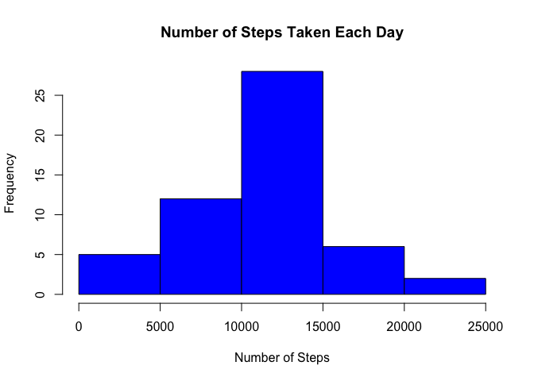
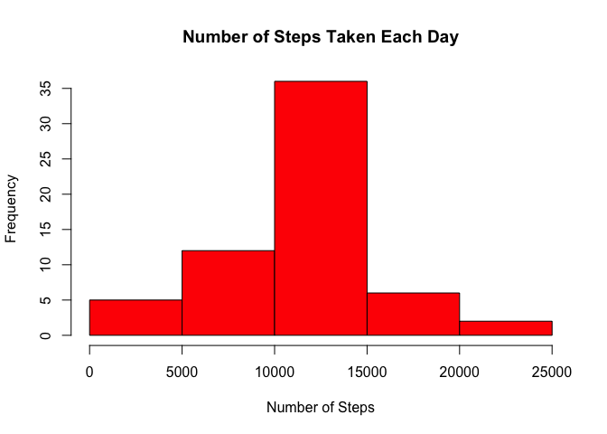
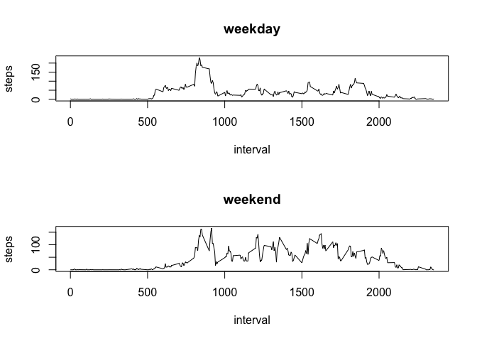

# Reproducible Research: Peer Assessment 1


## Loading and preprocessing the data
1. **Load the data from activity.csv.**

```r
data <- read.csv("activity.csv")
```


## What is mean total number of steps taken per day?
1. **Calculate the total number of steps taken per day.**

```r
steps <- tapply(data$steps, data$date, sum)
```

2. **Make a histogram of the total number of steps taken each day.**

```r
hist(steps, main = "Number of Steps Taken Each Day", 
    xlab = "Number of Steps", ylab = "Frequency", col = "blue")
```

\

3. **Calculate and report the mean and median of the total number of steps taken per day.**

```r
steps.mean <- mean(steps, na.rm = TRUE); steps.mean
```

```
## [1] 10766.19
```

```r
steps.median <- median(steps, na.rm = TRUE); steps.median
```

```
## [1] 10765
```

The **mean** steps taken per day is 1.0766189\times 10^{4}. The **median** steps taken per day is 10765.


## What is the average daily activity pattern?
1. **Make a time series plot of the 5-minute interval (x-axis) and the average number of steps taken, averaged across all days (y-axis).**

```r
steps.interval <- aggregate(steps ~ interval, data = data, mean, na.rm = TRUE)
plot(steps.interval, type = "l")
```

\

2. **Which 5-minute interval, on average across all the days in the dataset, contains the maximum number of steps?**

```r
maxInterval <- steps.interval$interval[which.max(steps.interval$steps)]; maxInterval
```

```
## [1] 835
```

The **835th** interval contains the maximum number of steps.

## Imputing missing values
1. **Calculate and report the total number of missing values in the dataset.**

```r
missing <- sum(is.na(data)); missing
```

```
## [1] 2304
```
There are **2304** missing values in the dataset.

2. **Devise a strategy for filling in all of the missing values in the dataset.**  
I will replace missing values with the mean for the corresponding 5-minute interval.

3. **Create a new dataset that is equal to the original dataset but with the missing data filled in.**

```r
## Function to retrieve mean steps for a given interval
interval.mean <- function(interval) {
    steps.interval[steps.interval$interval == interval, ]$steps
}

## Create new dataset with the original data
data.filled <- data

## Loop through dataset, replacing NA values with interval mean
for (i in 1:nrow(data.filled)) {
    if (is.na(data.filled[i, ]$steps)) {
        data.filled[i, ]$steps <- interval.mean(data.filled[i, ]$interval)
    }
}
```

4. **Make a histogram of the total number of steps taken each day.**

```r
data.filled.steps <- aggregate(steps ~ date, data = data.filled, sum)
hist(data.filled.steps$steps, main = "Number of Steps Taken Each Day",
     xlab = "Number of Steps", ylab = "Frequency", col = "red")
```

\

**Calculate and report the mean and median total number of steps taken per day.**

```r
data.filled.mean <- mean(data.filled.steps$steps); data.filled.mean
```

```
## [1] 10766.19
```

```r
data.filled.median <- median(data.filled.steps$steps); data.filled.median
```

```
## [1] 10766.19
```
The **mean** steps taken per day is 1.0766189\times 10^{4}. The **median** steps taken per day is 1.0766189\times 10^{4}.  
  
**Do these values differ from the estimates from the first part of the assignment? What is the impact of imputing missing data on the estimates of the total daily number of steps?**  
  
The mean value ended up being the same. The median value was only slightly different because of the number of missing values (an *odd* number of missing values results in the *middle* value being used, whereas an *even* number results in an *average* of the middle two values).  
  
**Conclusion:** Imputing missing values has **little to no impact** on the results.

## Are there differences in activity patterns between weekdays and weekends?
1. **Create a new factor variable in the dataset with two levels – “weekday” and “weekend” indicating whether a given date is a weekday or weekend day.**

```r
## Function to retrieve day type for given date (weekday or weekend)
daytype <- function(date) {
    ifelse(!weekdays(as.Date(date)) %in% c("Saturday", "Sunday"), "weekday", "weekend")
}
## Add daytype column to dataset
data.filled$daytype <- as.factor(sapply(data.filled$date, daytype))
```

2. **Make a panel plot containing a time series plot of the 5-minute interval (x-axis) and the average number of steps taken, averaged across all weekday days or weekend days (y-axis).**

```r
## Set parameters for 2x1 panel plot
par(mfrow = c(2, 1))

## Construct each time series plot
for (type in c("weekday", "weekend")) {
    steps.type <- aggregate(steps ~ interval, data = data.filled, subset = data.filled$daytype == 
        type, FUN = mean)
    plot(steps.type, type = "l", main = type)
}
```

\
